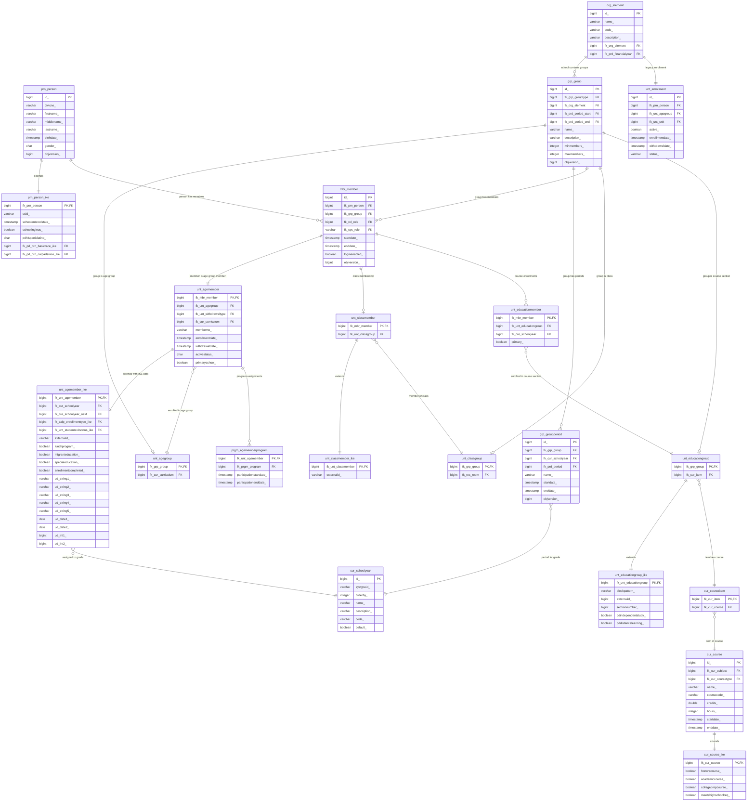

# IKE Enrollment System - Entity Relationship Diagram

## Core Enrollment Tables ERD



## Table Categories

### Primary Enrollment Flow (Modern System)
1. **Person** → prn_person + prn_person_ike
2. **Member** → mbr_member  
3. **Enrollment** → unt_agemember + unt_agemember_ike (PRIMARY)
4. **Grade Assignment** → cur_schoolyear
5. **School Assignment** → unt_agegroup → grp_group → org_element

### Secondary Assignments (Optional)
- **Class Assignment** → unt_classmember + unt_classmember_ike
- **Course Enrollment** → unt_educationmember → unt_educationgroup
- **Program Assignment** → prgm_agememberprogram

### Legacy System (Unused)
- **unt_enrollment** - Original Atlas enrollment table (superseded by age group member system)

## Key Relationships

1. **Student Identity**: prn_person ↔ prn_person_ike
2. **Core Enrollment**: unt_agemember ↔ unt_agemember_ike (THE PRIMARY ENROLLMENT)
3. **Grade Level**: unt_agemember_ike → cur_schoolyear
4. **School**: unt_agegroup → grp_group → org_element
5. **Class**: unt_classmember → unt_classgroup
6. **Courses**: unt_educationmember → unt_educationgroup → cur_courseitem → cur_course

## Data Flow Summary

```
Person → Member → Age Group Member (Enrollment) → Grade + School + Class + Courses
  ↓         ↓            ↓                           ↓      ↓       ↓       ↓
prn_*   mbr_member  unt_agemember_ike        cur_schoolyear org_* unt_class* unt_education*
```

The **unt_agemember_ike** table is the heart of the enrollment system, containing all meaningful enrollment data and linking to all other enrollment-related entities.
