# IKE Enrollment System - Complete Entity Relationship Diagram

## Complete ERD with All Fields

```mermaid
erDiagram
    %% Person Tables
    prn_person {
        bigint id_ PK
        bigint fk_sys_resource FK
        bigint fk_sys_country FK
        bigint fk_sys_language FK
        bigint fk_sys_languagesec FK
        bigint fk_sys_correspondantlang FK
        bigint fk_sys_countrybirth FK
        bigint fk_prn_educationleveltype FK
        bigint fk_adr_regionofbirth FK
        varchar civicno_ "NOT NULL"
        varchar firstname_
        varchar middlename_
        varchar lastname_
        varchar suffixname_
        varchar akafirstname_
        varchar akamiddlename_
        varchar akalastname_
        varchar akasuffixname_
        varchar title_
        varchar occupation_
        timestamp birthdate_
        varchar placeofbirth_
        char gender_
        boolean ofage_ "NOT NULL"
        boolean protectedidentity_ "NOT NULL"
        timestamp schoolentered_
        bigint degreeyear_
        bigint objversion_ "NOT NULL"
        bigint fk_prn_address FK
        bigint fk_prn_relation FK
        bigint fk_prn_contact FK
        bigint fk_prn_contact_phone FK
        bigint fk_prn_contact_email FK
        bigint fk_prn_contact_fax FK
    }
    
    prn_person_ike {
        bigint fk_prn_person PK,FK
        bigint fk_pd_prn_basicrace_ike FK
        bigint fk_pd_prn_basicrace2_ike FK
        bigint fk_prn_pareduleveltype_ike FK
        bigint fk_calp_namesuffix_ike FK
        bigint fk_calp_namesuffix_ike_aka FK
        bigint fk_pd_prn_calpadsrace_ike FK
        bigint fk_pd_prn_calpadsrace2_ike FK
        bigint fk_pd_prn_calpadsrace3_ike FK
        bigint fk_pd_prn_calpadsrace4_ike FK
        bigint fk_pd_prn_calpadsrace5_ike FK
        timestamp schoolenteredstate_
        varchar ssid_
        boolean schoolinginus_ "NOT NULL"
        boolean placeofbirthspeccircum_ "NOT NULL"
        varchar formerfirstname_
        varchar formermiddlename_
        varchar formersurname_
        varchar seid_
        char pdhispaniclatino_
        bigint fk_adr_natregregion FK
        timestamp gymnasiumcompleted_
        timestamp natregdate_
        char maritalstatus_
        boolean officialfinalgrade_
        boolean municipalityfinalgrade_
        char hogskf_
        char hogskn_
        char hogsks_
        char yrkfor_
        char imyrk_
        char impre_
        char impro_
        date elementarygradeimportdate_
        int elementarymeritvalue_
        varchar munfinalgrademodifiedby_
        timestamp munfinalgrademodified_
        char highschoolgradetype_
        varchar highschoolfiletype_
        int studenttotalpoints_
        int programtotalpoints_
        date highschoolgradeimportdate_
        varchar highschoolgradeimportedby_
        date deregisterdate_
        varchar folkbokfbetfast_
        boolean studycertificateuhr_
        varchar secondaryid_
    }
    
    %% Core Member Framework
    mbr_member {
        bigint id_ PK
        bigint fk_mbr_member FK
        bigint fk_grp_group FK "NOT NULL"
        bigint fk_rol_role FK
        bigint fk_prn_person FK "NOT NULL"
        varchar fk_sys_role FK "NOT NULL"
        int orderby_ "NOT NULL"
        varchar description_
        timestamp startdate_ "NOT NULL"
        timestamp enddate_
        boolean loginenabled_ "NOT NULL"
        bigint objversion_ "NOT NULL"
    }
    
    %% Enrollment Tables - Modern System
    unt_agemember {
        bigint fk_mbr_member PK,FK
        bigint fk_cur_curriculum FK
        bigint fk_unt_agegroup FK
        bigint fk_unt_agememberstatus FK
        bigint fk_unt_withdrawaltype FK
        varchar memberno_
        timestamp enrollmentdate_
        timestamp activedate_
        timestamp withdrawaldate_
        char activestatus_
        boolean primaryschool_ "NOT NULL"
    }
    
    unt_agemember_ike {
        bigint fk_unt_agemember PK,FK
        bigint fk_unt_engproficiency_ike FK
        bigint fk_unt_birthdateverif_ike FK
        bigint fk_prn_person_bverifdate_ike FK
        bigint fk_cur_schoolyear FK "NOT NULL"
        char districttransfer_
        bigint fk_cur_schoolyear_next FK
        timestamp intdisttransapprovaldate_
        timestamp birthdateverifdate_
        timestamp ssidverifdate_
        boolean lunchprogram_ "NOT NULL"
        boolean migranteducation_ "NOT NULL"
        boolean specialeducation_ "NOT NULL"
        char ssidrequeststatus_
        timestamp dateredesignatedfep_
        boolean uccoursereqmet_ "NOT NULL"
        timestamp districtentereddate_
        boolean enrollmentcompleted_ "NOT NULL"
        boolean photopermission_ "NOT NULL"
        boolean directorypermission_ "NOT NULL"
        boolean internetconsent_ "NOT NULL"
        varchar externalid_
        bigint fk_unt_unit_next FK
        boolean donotincludeinpreid_ "NOT NULL"
        text atriskalertcomment_
        timestamp directcertdate_
        char directcertstatus_
        bigint fk_unt_gradechangereason_ike FK
        varchar withdrawalcomment_
        varchar receiverschool_
        varchar previousschool_
        varchar districtofresidence_
        bigint fk_unt_unit_residence FK
        bigint fk_unt_busnumber_ike FK
        bigint fk_unt_busstop_ike FK
        bigint fk_calp_schoolcompstat_ike FK
        bigint fk_calp_enrollmenttype_ike FK
        bigint fk_unt_studentexitstatus_ike FK
        bigint fk_calp_intdisttransfcat_ike FK
        bigint fk_calp_engteststat_ike FK
        
        boolean csroverflow_ "NOT NULL"
        varchar pdshoolofattendancenps_
        varchar pdninthgradeentryyear_
        boolean nativelanguageeducation_ "NOT NULL"
        bigint fk_unt_travelcard_ike FK
        boolean createdactivityresponsibility_
        timestamp created_
    }
    
    %% Group Structure
    grp_group {
        bigint id_ PK
        bigint fk_grp_grouptype FK "NOT NULL"
        bigint fk_org_element FK "NOT NULL"
        bigint fk_prd_period_start FK "NOT NULL"
        bigint fk_prd_period_end FK
        bigint fk_grp_group FK
        bigint fk_res_room FK
        bigint fk_mbr_member FK
        varchar name_ "NOT NULL"
        varchar description_
        int minmembers_ "NOT NULL"
        int maxmembers_ "NOT NULL"
        bigint objversion_ "NOT NULL"
    }
    
    unt_agegroup {
        bigint fk_grp_group PK,FK
        bigint fk_cur_curriculum FK
    }
    
    grp_groupperiod {
        bigint id_ PK
        bigint fk_grp_group FK "NOT NULL"
        bigint fk_cur_schoolyear FK
        bigint fk_prd_period FK
        varchar name_ "NOT NULL"
        varchar description_
        timestamp startdate_ "NOT NULL"
        timestamp enddate_
        bigint objversion_ "NOT NULL"
    }
    
    %% Grade/School Year
    cur_schoolyear {
        bigint id_ PK
        varchar systypeid_ "NOT NULL"
        int orderby_ "NOT NULL"
        varchar name_ "NOT NULL"
        varchar description_
        varchar code_
        boolean default_ "NOT NULL"
        varchar group_
        timestamp startdate_
        timestamp enddate_
        bigint objversion_ "NOT NULL"
        bigint fk_trn_typetranslations FK
        varchar translationbase_
    }
    
    %% Organization Structure
    org_element {
        bigint id_ PK
        bigint fk_org_element FK
        bigint fk_org_elementtype FK "NOT NULL"
        bigint fk_sys_resource FK
        varchar fk_cus_customer FK "NOT NULL"
        bigint fk_prd_financialyear FK
        int orderby_ "NOT NULL"
        varchar name_ "NOT NULL"
        varchar description_
        varchar orgno_
        varchar code_
        varchar statisticcode_
        varchar license_
        bigint objversion_ "NOT NULL"
        bigint fk_org_contact FK
    }
    
    %% Class Assignment Tables
    unt_classmember {
        bigint fk_mbr_member PK,FK
        bigint fk_unt_classgroup FK
    }
    
    unt_classmember_ike {
        bigint fk_unt_classmember PK,FK
        varchar externalid_
    }
    
    unt_classgroup {
        bigint fk_grp_group PK,FK
        bigint fk_res_room FK
    }
    
    %% Course Assignment Tables
    unt_educationmember {
        bigint fk_mbr_member PK,FK
        bigint fk_unt_educationgroup FK
        bigint fk_cur_schoolyear FK
        boolean primary_ "NOT NULL"
    }
    
    unt_educationgroup {
        bigint fk_grp_group PK,FK
        bigint fk_cur_item FK "NOT NULL"
    }
    
    unt_educationgroup_ike {
        bigint fk_unt_educationgroup PK,FK
        bigint fk_unt_multipleteacherst_ike FK
        bigint fk_calp_instructionallev_ike FK
        varchar blockpattern_
        bigint externalid_
        bigint sectionnumber_
        boolean pdindependentstudy_ "NOT NULL"
        boolean pddistancelearning_ "NOT NULL"
    }
    
    %% Course Structure
    cur_course {
        bigint id_ PK
        bigint fk_cur_course FK
        bigint fk_cur_subject FK "NOT NULL"
        bigint fk_cur_coursetype FK
        bigint fk_unt_unit FK
        bigint fk_org_element FK
        int orderby_ "NOT NULL"
        varchar name_ "NOT NULL"
        varchar coursecode_ "NOT NULL"
        double credits_ "NOT NULL"
        int hours_ "NOT NULL"
        timestamp startdate_ "NOT NULL"
        timestamp enddate_
        varchar description_
        bigint objversion_ "NOT NULL"
    }
    
    cur_courseitem {
        bigint fk_cur_item PK,FK
        bigint fk_cur_course FK "NOT NULL"
    }
    
    cur_course_ike {
        bigint fk_cur_course PK,FK
        bigint fk_cur_ucapprovecourse_ike FK
        bigint fk_cur_nclbcorecourse_ike FK
        bigint fk_cur_cbedssubjectarea_ike FK
        bigint fk_cre_authorisationtype FK "NOT NULL"
        bigint fk_calp_edprogcoursecont_ike FK
        boolean honorscourse_ "NOT NULL"
        boolean academiccourse_ "NOT NULL"
        boolean excludefromrank_ "NOT NULL"
        boolean collegeprepcourse_ "NOT NULL"
        boolean meetshighschoolreq_ "NOT NULL"
        boolean pdnotreportcalpads_ "NOT NULL"
    }
    
    %% Legacy Enrollment Table (unused in modern system)
    unt_enrollment {
        bigint id_ PK
        bigint fk_prn_person FK "NOT NULL"
        bigint fk_unt_agegroup FK
        bigint fk_unt_withdrawaltype FK
        bigint fk_unt_unit FK "NOT NULL"
        boolean active_ "NOT NULL"
        timestamp activedate_
        timestamp enrollmentdate_
        varchar status_
        timestamp withdrawaldate_
        bigint objversion_ "NOT NULL"
    }
    
    %% Program Assignment
    prgm_agememberprogram {
        bigint fk_unt_agemember PK,FK
        bigint fk_prgm_program FK "NOT NULL"
        timestamp participationstartdate_ "NOT NULL"
        timestamp participationenddate_
        bigint objversion_ "NOT NULL"
    }
    
    %% Relationships
    prn_person ||--|| prn_person_ike : "extends with IKE data"
    prn_person ||--o{ mbr_member : "person has multiple memberships"
    
    mbr_member ||--|| unt_agemember : "member becomes age group member"
    unt_agemember ||--|| unt_agemember_ike : "extends with complete enrollment data"
    
    grp_group ||--o| unt_agegroup : "group specializes as age group"
    grp_group ||--o{ grp_groupperiod : "group spans multiple periods"
    grp_group ||--o{ mbr_member : "group contains members"
    
    unt_agemember }o--|| unt_agegroup : "enrolled in specific age group"
    unt_agemember_ike }o--|| cur_schoolyear : "assigned to grade level"
    grp_groupperiod }o--|| cur_schoolyear : "period covers grade"
    
    org_element ||--o{ grp_group : "organization contains groups"
    org_element ||--o{ unt_enrollment : "legacy direct enrollment"
    
    mbr_member ||--o| unt_classmember : "optional class membership"
    unt_classmember ||--|| unt_classmember_ike : "extends class membership"
    unt_classmember }o--|| unt_classgroup : "assigned to homeroom"
    grp_group ||--o| unt_classgroup : "group functions as class"
    
    mbr_member ||--o{ unt_educationmember : "multiple course enrollments"
    unt_educationmember }o--|| unt_educationgroup : "enrolled in course section"
    unt_educationgroup ||--|| unt_educationgroup_ike : "extends course section"
    grp_group ||--o| unt_educationgroup : "group functions as course section"
    unt_educationgroup }o--|| cur_courseitem : "section teaches course item"
    cur_courseitem }o--|| cur_course : "item belongs to course"
    cur_course ||--|| cur_course_ike : "extends course with IKE data"
    
    unt_agemember ||--o{ prgm_agememberprogram : "enrolled in programs"
```

## Field Type Legend

- **PK** = Primary Key
- **FK** = Foreign Key  
- **NOT NULL** = Required field
- **varchar** = Variable length string
- **bigint** = Large integer
- **int** = Integer
- **char** = Fixed length character
- **boolean** = True/False
- **timestamp** = Date and time
- **date** = Date only
- **double** = Floating point number
- **text** = Long text

## Key Table Categories

### **1. Primary Enrollment Flow (Modern System)**
**Core Path:** Person → Member → Age Group Member (with IKE extensions)

### **2. Organizational Structure**
**Hierarchy:** Organization → Groups → Age Groups → Grade Periods

### **3. Secondary Assignments (Optional)**
- **Homeroom Classes:** Class member tables
- **Course Sections:** Education member tables  
- **Special Programs:** Program member tables

### **4. User-Defined Fields (IKE Extension)**
**unt_agemember_ike contains 50 customizable fields:**
- **20 String fields** (ud_string1_ through ud_string20_)
- **10 Integer fields** (ud_int1_ through ud_int10_)
- **10 Date fields** (ud_date1_ through ud_date10_)
- **10 Float fields** (ud_float1_ through ud_float10_)

### **5. Legacy System (Unused)**
**unt_enrollment** - Original Atlas framework enrollment table superseded by the age group member system

## Critical Design Insights

1. **Extension Pattern:** IKE extends Atlas base tables with "_ike" suffix tables containing California-specific fields
2. **Flexibility:** 50 user-defined fields allow custom data without schema changes
3. **Comprehensive Tracking:** Every aspect of enrollment, demographics, programs, and academics is captured
4. **State Compliance:** Extensive California-specific fields for CALPADS reporting
5. **Legacy Compatibility:** Original Atlas tables maintained but unused in business logic

 ## Total Tables in Enrollment ERD: 19 Tables

###  Core Enrollment Tables (4 tables)

  1. unt_agemember - Base enrollment
  2. unt_agemember_ike - Primary enrollment table (THE MOST IMPORTANT)
  3. mbr_member - Member framework
  4. unt_enrollment - Legacy enrollment (unused)

  ### Person/Identity Tables (2 tables)

  5. prn_person - Base person data
  6. prn_person_ike - Extended person data

  Group/Organizational Structure Tables (4 tables)

  7. grp_group - Base group structure
  8. unt_agegroup - Age group extension
  9. grp_groupperiod - Group periods
  10. org_element - Schools/organizations

 ### Academic Structure Tables (1 table)

  11. cur_schoolyear - Grade levels

 ### Class Assignment Tables (3 tables)

  12. unt_classmember - Base class membership
  13. unt_classmember_ike - Extended class membership
  14. unt_classgroup - Homeroom classes

 ### Course Assignment Tables (3 tables)

  15. unt_educationmember - Course enrollments
  16. unt_educationgroup - Course sections
  17. unt_educationgroup_ike - Extended course sections

 ### Course Definition Tables (2 tables)

  18. cur_course - Course definitions
  19. cur_courseitem - Course items

 ### Missing from ERD but mentioned:
  - cur_course_ike - Course extensions
  - prgm_agememberprogram - Program assignments

  Actual Total: 21 Tables

  By Importance for Enrollment:

 ### Critical (Must Have):
  - unt_agemember_ike - Primary enrollment data
  - prn_person + prn_person_ike - Student identity
  - mbr_member - Member framework
  - cur_schoolyear - Grade assignment
  - org_element - School assignment

 ###  Important (Common Use):
  - unt_classmember + unt_classmember_ike - Homeroom assignment
  - unt_educationmember + unt_educationgroup - Course enrollment

  Supporting (Infrastructure):
  - grp_group, unt_agegroup, grp_groupperiod - Group structure
  - cur_course, cur_courseitem, cur_course_ike - Course catalog

  ### Legacy (Unused):
  - unt_enrollment - Old enrollment system

  ## Summary

  21 total tables are involved in the complete IKE enrollment system, with unt_agemember_ike being the central table that contains the primary enrollment data and connects to      
  all other components of the system.
